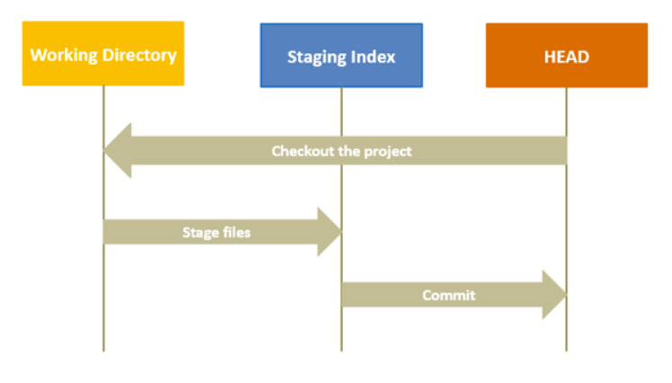
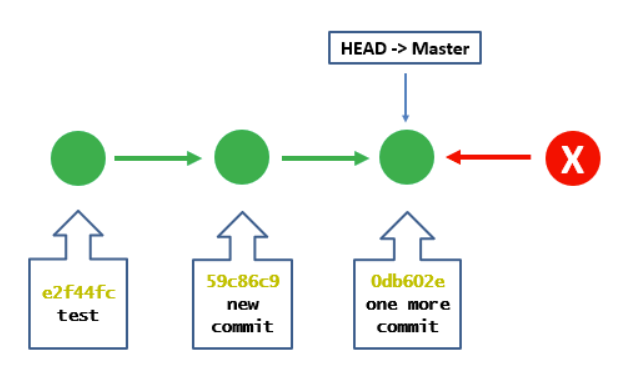
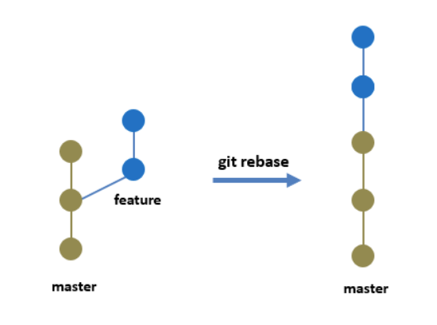

# Git-Collaboration-Exercise
Please make your own branch from this main repo and add your update to the main branch.


## New Branch Process:

1. Clone this repository to your local machine.

Terminal:

``` sh
cd ~/.../project_folder

git clone <SSH> # if using SSH key

OR

git clone <HTTPS> # if using PAT

cd <Repo Name>
```

2. Create and checkout the branch of this repository

Terminal:

``` sh
git branch <name of branch>. # create a new branch locally
git checkout <name of branch> # swich to the new created branch
```

3. Add the modified file(s) to the branch

Terminal:

``` sh
git add .  # add any update to the new branch
git commit -m "message for the update"  # commit the change with a message
git log --all --graph  # check the staging status in the new branch
```

4. Merge the branch to the main repository on GitHub

Terminal:

``` sh
git checkout main  # switch back to main branch locally
git merge <name of branch> -m "message for the update"  # merge the changes in new branch to main locally
git push -u origin <name of branch>  # push the change from new branch to the remote, namely "origin"
git log --all --graph  # check all the log status 
```

5. Create a Pull Request on GitHub

Go back to the GitHub remote repository and check to see if the branch is created.
Click on the green "Pull Request" button to create a pull request.
OR
Click on "Pull request" tab at the top of the repository and click the green "Create pull request" button.

6. Review and discuss the changes

Review the code from the author of this branch.

7. Approve the merge

Merge the branch once the team agrees to the update.

8. Update Local Repository (ONLY IF the change has not been merged locally!!)

Terminal:

``` sh
git fetch 
git checkout main
git log --all --graph
git pull origin main
git log --all --graph
```

## Fetch, Commits, Pull Request

1. Fetch a Remote Branch

When a new development branch is created by your team member, we can fetch the new remote branch to a local repository.  It's not an often case that you need all the development branches fetched to the local repo.  One of the most common cases is that a tema member needs the code source from another member to continue his/her work.  If collaboration code is not needed, try to avoid fetching other branches to the local repo when working on a specific dev branch for your assigned task.

Terminal:

``` sh
git fetch origin <name of branch> # fetching all updated remote branches to the local repo
git branch  # Check to see if the branch is fetched
git checkout <name of branch>
```

2. Commits

When a task is assigned to a member in a team, one can commit and push changes to his/her remote dev branch as many time as needed.  The best practice is to commit as frequent as possible for the completed steps within the scope fo the assigned task. 

e.g. A member is assigned a task to complete 5 data visualization by the end of the week.  First, this member should create a dev branch for this task. While the member is working on this task, he/she **SHOULD** commit the changes after each visual is created. The benefit for committing changes frequently is to better define a version of the source code so when something went wrong, he/she can chase back to the most recent version of the repo.

Note that the member does not need to push every commit to the remote dev branch, but they should push a bunch of commits at once to the remote.  For example, commit 3 visuals one by one, then push all 3 commits to the remote dev branch all at once.

Terminal:

``` sh
git add .  # or specify a specific file
git commit -m 'message for the update'  # be as specific as possible

## After several commits, they can all be packed in a single push
git push --set-upstream origin <name of branch>
git log --all --graph # Check the log for all commits to the remote dev branch
```

3. Pull Request

Once a member completed a task that was assigned by a team, he/she should 1) push all final updates to the remote dev branch, 2) submit a pull request for the final version of the dev branch, and 3) inform the team to assign a member to review and make comment on the code source and approve for merging the code.  

Note that no one should ever approve their own code and merge to the main branch.  Imagine a member accidentally approve his/her own code and merge the branch to main without noticing the rest of the team.  It could cause a big mess while others are merging their code to the main branch later (merge conflict, incorrect version of package for the analysis, incorrect data source directory, etc).  Therefore, the team needs to communicate well to avoid any kind of conflict of merging their code.  Remember, the ```origin main``` branch is the final version of the project.  No one should have the right to merge their dev branch into ```main```.

The good practice could be scheduling a code review section once a pull request is submitted.  A member in the team will review and comment on the updates.  If revision is needed, send message to the member who submitted the pull request and have he/she review the code source.  Once the final version is reviewed, the review member can then inform another member in the team to approve the pull request so the dev branch can finally merged into the ```main```.  

GitHub provides some nice UI for the pull reqeust revision.  Check out the documentation from GitHub for detail. 

## Reset, Rebase, Revert
In a git reset workflow, three internal management mechanisms of git come into the picture: HEAD, staging area (index), and the working directory.



The **working directory** is the place where you are currently working, it is the place where your files are present. Using a git status command, you can see what all files/folders are present in the working directory.

**Staging Area (Index)** is where git tracks and saves all the changes in the files. The saved changes are reflected in the .git directory. You use git add “filename” to add the file to the staging area. And like before, when you run git status, you will see which files are present in the staging area.

The current branch in Git is referred to as **HEAD**. It points to the last commit, which happened in the current checkout branch. It is treated as a pointer for any reference. Once you checkout to another branch, the HEAD also moves to the new branch.

### 1. Soft Reset vs. Hard Reset
Generally speaking, if you need reset the working directory pointing to different commit stage, you should always do a **soft reset**.  The difference between a hard reset and a soft reset is that **hard reset** allows us to change the commit history and point to the specified commit, but it also removes all the commits with happended after the specific commit. Soft reset allows us to point to the specified commit in history, but keeps the files in the working directory. There is no risk of losing the files in the soft mode.  



Terminal: (Hard Reset)
Assume a file is deleted in the local main branch by accident.

```
# check your current main branch status
git status 

# log the current commits
git log --all --graph

# reset the to the previous commit
git reset --hard <specified SHA key>  # back to secified commit
git reset --hard^  # back to the most recent commit

# check the log history to confirm HEAD pointer
git log --all --graph
```

Terminal: (Soft Reset)
Assume a file is added to the local branch by accident.

```
# check your current main branch status
git status 

# log the current commits
git log --all --graph

# reset the to the previous commit
git reset --soft <specified SHA key>  # back to secified commit
git reset --hard^  # back to the most recent commit

# check the log history to confirm HEAD pointer
git log --all --graph
```

### 2. Git Revert
In Git, the **revert** command is used to perform a revert operation, i.e., to revert some changes. It is similar to the reset command, but the only difference here is that you perform a new commit to go back to a particular commit. In short, it is fair to say that the git revert command is a commit.

[git_revert](images/git_revert.png)

Terminal: 
Assume an update of a code file is pushed / merged to the remote dev branch.

```
# check your current main branch status
git status 

# log the current commits
git log --all --graph

# revert the to the previous commit
git revert <specified SHA key> # revert to specified commit
git revert HEAD  # revert to the latest commit

# check the log history to confirm HEAD pointer
git log --all --graph
```

### 3. Git Rebase
In Git, **rebase** is the way of moving or combining commits of one branch over another branch. As a developer, I would not create my features on the master branch in a real-world scenario. I would work on my own branch (a ‘feature branch’), and when I have a few commits in my feature branch with the feature added, I would then like to move it to the master branch.

Rebase can sometimes be a little confusing to understand because it is very similar to a merge. The goal of merging and rebasing both is to take the commits from my feature branch and put them on to a master branch or any other branch. 

Suppose you are working in a team with other developers. In that case, you can imagine that this could get really complex where you have a bunch of other developers working on different feature branches, and they have been merging multiple changes. It becomes confusing to trace.

So, this is where rebase is going to help. This time, instead of doing a git merge, I will do a rebase, where I want to take my two feature branch commits and move them onto the master branch. A rebase will take all my commits from the feature branch and move them on top of the master branch commits. So, behind the scenes, git is duplicating the feature branch commits on the master branch.



Terminal:
Assume a new file is added to the local dev branch and would like to add to the local main branch.

```
# check your current dev branch status
git status 

# add the new file to the staging
git add .

# commit the change
git commit -m <commit message>

# log the current commits
git log --all --graph

# add the new file to the main using rebase command
git rebase main  # note: rebase command should be run from the dev branch

# checkout the local main branch
git checkout main

# rebase the master branch against the dev branch
git rebase <dev branch name>

# confirm the dev branch have been added to the main branch successfully
git log --all --graph
```
